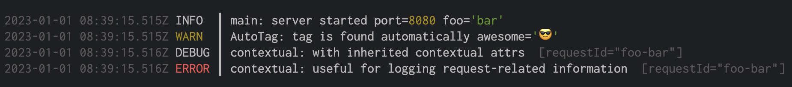

# 🌲🪵 `pine-log`


Simple yet powerful logger based on [pino](https://github.com/pinojs/pino) with contextual logging support.




```
npm i pino@8 pine-log
```

#### Features

 * **Contextual Logging**: powered by [Async Local Storage](https://nodejs.org/api/async_hooks.html) introduced in Node v14.
 * **Automatic**: Automatically finds a tag by parsing the caller class/function
 * **Performance**: It's basically an add-on of [pino](https://github.com/pinojs/pino), which has [very low overhead](https://github.com/pinojs/pino/blob/master/docs/benchmarks.md)
 * **Convenience**: Production-Ready Default Configuration


##### Prerequisites

* **Node.JS v14 or newer** (Recommend: v16.4.0 or newer)


## LICENSE: MIT
